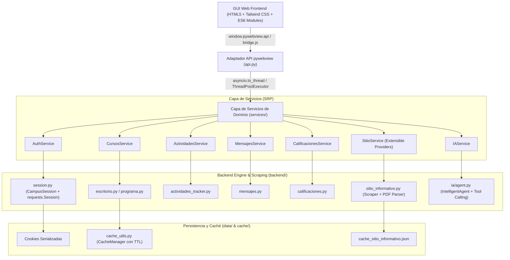

# 🧠 Mapa de Arquitectura y Conexión de Módulos — Campus Virtual IES N°5 Launcher (v3.0)

Este documento sirve como la **fuente de verdad y cerebro de conocimiento** (compatible con Obsidian y agentes IA) para entender la interconexión entre la capa de scraping, los servicios de dominio Python, el puente IPC de pywebview y la interfaz gráfica web híbrida.

---

## 🏗️ 1. Diagrama General de Capas (Arquitectura Híbrida Non-Blocking)

---

## 🔌 2. Módulos y sus Responsabilidades Únicas (SRP)

### A. Capa Frontend (`web_gui/`)
* **`index.html`**: Estructura principal en HTML5 puro con clases dinámicas Tailwind CSS. Contiene las pestañas (`#tab-escritorio`, `#tab-materias`, `#tab-actividades`, `#tab-novedades`, `#tab-ia`, `#tab-ajustes`) y los modales interactivos (`#modal-ayuda`, `#modal-tutorial`, `#modal-detalle`).
* **`js/bridge.js`**: Envoltorio singleton `PyloidBridge` / `pywebview.api`. Aísla todas las llamadas asíncronas entre JavaScript y Python.
* **`js/app_stitch.js`**: Controlador de estado reactivo global (`appState`). Maneja el ciclo de vida del usuario, autenticación, renderizado incremental sin reflow y navegación por eventos.
* **`css/styles.css`**: Sistema de temas (`midnight`, `dark`, `emerald`, `light`) y reglas de contención anti-parpadeo (`contain: layout style`, `font-display: block` para Material Symbols).

### B. Adaptador IPC (`api.py`)
* Expone la clase `CampusAPI` al contexto global de JavaScript mediante `pywebview.js_api`.
* Encapsula la ejecución de todas las funciones de E/S bloqueante en un `ThreadPoolExecutor` para asegurar que la interfaz visual funcione a **60 FPS sin congelar QtWebEngine**.
* Retorna un contrato de respuesta JSON unificado:
  $$\text{Respuesta} = \{\text{"ok"}: \text{bool}, \text{"data"}: \text{Any}, \text{"error"}: \text{str} \mid \text{None}\}$$

### C. Capa de Servicios de Dominio (`services/`)
1. **`auth_service.py`**: Inicio de sesión, validación de DNI y contraseña contra el campus INFD, restauración transparente de cookies.
2. **`cursos_service.py`**: Extracción y almacenamiento en caché del escritorio del alumno, materias inscriptas, unidades temáticas y contenido pedagógico.
3. **`actividades_service.py`**: Monitoreo de trabajos prácticos, foros evaluables y actividades con fecha límite de entrega.
4. **`mensajes_service.py`**: Bandeja de entrada, lectura, redacción, respuesta y eliminación de mensajes por el correo interno del campus.
5. **`calificaciones_service.py`**: Consulta de notas por materia e historial general.
6. **`sitio_service.py`**: Noticias institucionales y portal del IES N°5. Arquitectura **Provider Pattern** que permite conectar fácilmente múltiples fuentes (Sitio Web Oficial, Redes Sociales, Blogs, RSS).
7. **`ia_service.py`**: Servicio del Asistente IA. Orquesta el agente inteligente compartiendo exactamente las mismas funciones de la API que la GUI web (cero lógica duplicada).

### D. Motor Backend y Scraping (`backend/`)
* **`session.py`**: Mantiene la conexión HTTP persistente con la plataforma INFD utilizando `requests.Session` con políticas de reintento automático y backoff exponencial (`urllib3.util.Retry`).
* **`scraper.py`**: Decodificación de HTML, sanitización de textos y extracción de scripts JSON incrustados.
* **`sitio_informativo.py`**: Scraper público del portal de la institución y parser binario de documentos PDF sin dependencias externas pesadas.

---

## 🤖 3. Flujo del Asistente IA (Gemini & Fallback Manager)

1. El usuario envía una consulta en la pestaña `#tab-ia`.
2. `IAService.consultar(prompt)` ejecuta `IntelligentAgent.procesar_consulta(prompt)`.
3. El agente evalúa las credenciales en la configuración:
   * **Opción 1 (Prioritaria)**: Google Gemini API mediante `FallbackManager` con Tool Calling activado.
   * **Opción 2**: OpenAI API.
   * **Opción 3 (Offline)**: Motor local de coincidencia por intención (fechas, parciales, tareas pendientes).
4. El agente utiliza exactamente las mismas funciones de `CursosService`, `ContactosService` y `ActividadesService` para obtener los datos reales del estudiante.

---

## 🛡️ 4. Guía de Mantenimiento y Extensibilidad

* **Para agregar un nuevo proveedor de noticias**:
  Invocá `sitio_service.registrar_proveedor_noticias("mi_fuente", "Nombre", fetcher_func)` en `SitioService`.
* **Para agregar una nueva vista en el Frontend**:
  1. Agregá la sección `<section id="tab-mi-vista" class="tab-content hidden">` en `index.html`.
  2. Registrá el botón `<button onclick="switchTab('mi-vista')">` en la barra lateral.
  3. Agregá la función de renderizado en `app_stitch.js`.

---
*Documentación generada para el repositorio oficial IES N°5 Launcher (Versión 3.0).*
